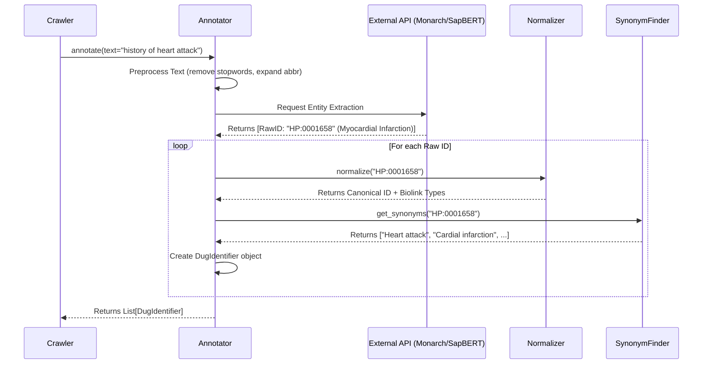

# Dug Annotation Architecture

The Annotation phase is the semantic engine of Dug. Its purpose is to analyze the unstructured text descriptions of variables and studies and extract structured, interoperable ontology identifiers (CURIEs). These identifiers serve as the "hooks" that link disparate datasets to the broader biomedical knowledge graph.

## 1. Core Architecture

The annotation pipeline is built around a modular sequence of operations: Identify $\rightarrow$ Normalize $\rightarrow$ Enrich.

### Key Components

#### 1. Annotator (`Annotator`):

* Role: The entry point. It accepts raw text (e.g., "Patient has type 2 diabetes") and returns a list of biological entities found in that text.

* Implementations:

  * Monarch Annotator: Uses the Monarch SciGraph API for dictionary-based named entity recognition (NER).

  * Sapbert Annotator: Uses a token classification model (SapBERT) to identify entities, suitable for more complex or context-heavy matching.

#### 2. Normalizer (`DefaultNormalizer`):

* Role: Takes a raw ID found by the annotator (which might be deprecated or from a non-standard ontology) and maps it to a "preferred" CURIE using the Translator Node Normalization service.

* Output: Updates the `DugIdentifier` with the preferred ID, Label, and Biolink Types (e.g., mapping `biolink:Disease` to `disease`).

#### 3. Synonym Finder (DefaultSynonymFinder):

* Role: Fetches a list of synonyms for the normalized ID. This ensures that a user searching for "Heart Attack" can find a variable annotated with "Myocardial Infarction".

#### 4. DugIdentifier:

* Role: The data object passed through the pipeline. It starts as a raw hit and gains metadata (preferred labels, types, synonyms) as it moves through normalization and enrichment.

## 2. Data Flow

When `dug crawl` runs, the `Crawler` passes the description of every parsed element to the configured Annotator.


## 3. Existing Implementations

### Monarch Annotator

* **Location**: `src/dug/core/annotators/monarch_annotator.py`
* **Mechanism**: Uses a "sliding window" approach to chunk long descriptions and sends them to the Monarch API.
* **Best For**: General biomedical text where exact ontology term matching is sufficient.


### Sapbert Annotator

* **Location**: src/dug/core/annotators/sapbert_annotator.py

* **Mechanism** :

  * **Token Classification** : Sends text to a dense labeling API to identify spans of text that look like biomedical entities.

  * **Grounding**: Sends those spans to a SapBERT model to resolve them to specific ontology IDs (e.g., linking the text span "heart failure" to MONDO:0005009).

  * **Best For**: Noisy text or when "fuzzy" semantic matching is needed.

## 4. How to Extend the Architecture

You can add new annotation methods (e.g., using a local LLM, AWS Comprehend, or a custom dictionary) by implementing the Annotator interface and registering it via pluggy.

### Step 1: Create the Annotator Class

Create a new file (e.g., `src/dug/core/annotators/custom_annotator.py`). Your class must implement `__call__`.
```python
import logging
from typing import List
from dug.core.annotators._base import DugIdentifier
from dug.config import Config

logger = logging.getLogger('dug')

class CustomAnnotator:
    def __init__(self, normalizer, synonym_finder, config: Config, **kwargs):
        self.normalizer = normalizer
        self.synonym_finder = synonym_finder
        self.api_key = kwargs.get('api_key', '')

    def __call__(self, text: str, http_session) -> List[DugIdentifier]:
        # 1. Preprocess text
        clean_text = text.lower()

        # 2. Call your custom logic/API to find entities
        # (Pseudo-code example)
        raw_matches = self.find_entities_in_text(clean_text)
        
        processed_identifiers = []
        for match in raw_matches:
            # Create a preliminary identifier
            raw_id = DugIdentifier(
                id=match['curie'],
                label=match['name'],
                types=match['type']
            )

            # 3. Normalize (Crucial for Knowledge Graph integration)
            norm_id = self.normalizer(raw_id, http_session)
            if not norm_id:
                continue

            # 4. Enrich with Synonyms
            norm_id.synonyms = self.synonym_finder(norm_id.id, http_session)
            
            processed_identifiers.append(norm_id)

        return processed_identifiers

    def find_entities_in_text(self, text):
        # Your custom implementation here
        return [{"curie": "MONDO:0005009", "name": "Heart Failure", "type": "biolink:Disease"}]
```

### Step 2: Register the Annotator

Modify `src/dug/core/annotators/__init__.py` to register your new class using the `define_annotators` hook.
```python

from .custom_annotator import CustomAnnotator

@hookimpl
def define_annotators(annotator_dict: Dict[str, Annotator], config: Config):
    # ... existing annotators ...
    
    # Register the factory function or class
    annotator_dict["custom"] = CustomAnnotator(
        normalizer=DefaultNormalizer(**config.normalizer),
        synonym_finder=DefaultSynonymFinder(**config.synonym_service),
        config=config
    )
```

### Step 3: Update Configuration

If your annotator needs specific settings (like URLs or API keys), add them to `src/dug/config.py`.

```python
@dataclass
class Config:
    # ... existing config ...
    
    annotator_args: dict = field(
        default_factory=lambda: {
            "monarch": { ... },
            "sapbert": { ... },
            "custom": {
                "api_key": "SECRET_KEY",
                "endpoint": "http://my-custom-ner-service/"
            }
        }
    )
```

### Step 4: Run

Use the `--annotator` flag in the CLI to use your new logic:

```dug crawl my_data.csv --parser topmedtag --annotator custom```
