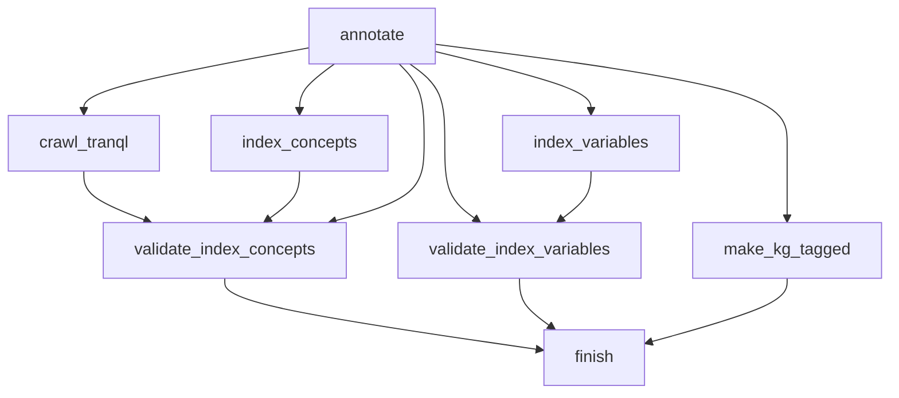

# Pipeline architecture description

The primary function of the Roger package is to allow the data pipeline steps in
Dug to be broken down into sizes that can be managed by orchestration services
(whether that's a command line, a Makefile, Apache Airflow, or other).

## Knowledge graph building pipeline

A key component of the Dug system takes concepts that have been found and
annotated in source data sets and expands them to a broader range of associated
concepts. By doing this, searches on a particular concept will also find results
which are closely related in the semantics of the knowledge graph.

In order for this system to work, the knowledge graph must be fully built and
loaded into the knowledge graph database which is then accessed through a
knowledge graph API. This pipeline produces those graphs using a bulk loader
process which translates an on-disk knowledge graph to one stored in a
graph-aware database.

First, a collection of graphs are merged by matching nodes that are the same
between graphs. The resulting new, large graph is then prepared for loading
through the extraction of graph database schemata for the nodes and edges. Roger
then prepares CSV files of the full graph data, then loads them using the
RedisGraph bulk loader.

By the end of this process, the knowledge graph API server is ready to use for
concept expansion.

## Annotate and Index Pipeline

For Dug Search to work properly, it must have a base of documents that have been
indexed in ElasticSearch. This pipeline calls objects and procedures inside the
Dug code to first call a parser (configured specifically for each data
set). This extracts a list of elements which then gets passed to a crawler
object, which annotates the original files with both variables and concepts.

The variables documents get immediately loaded to ElasticSearch for indexing,
after which those indexes are validated.

The concept documents are further expanded using the concept knowledge

# Building custom Dug data pipelines

The pipelines submodule is where data pipelines can be defined for specific data
sets with specific, custom behaviors for each one. In previous versions of the
code, customizations for each pipeline were spread across several modules. With
this instantiation, the customizations for each data set pipeline are
consolidated into a single overridden subclass of the DataPipeline class.

## What the base pipeline does

The function `roger.tasks.create_pipeline_taskgroup`, when called with the given
data pipeline class, will emit an Airflow task group with the following
structure. If Airflow is not being used, another executor should use a similarly
structured set of calls and dependencies to ensure that the task pipeline
executes fully and in order.


The pipeline steps are briefly described below

### annotate

By default, `annotate` will call the `get_objects` method to collect a list of
parsable files. For each of these files, a Dug Crawler object will be created
which will apply the parser returned by the pipeline class's `get_parser_name`
method. (This by default will return `parser_name` if it's defined, or will fall
back to `pipeline_name`.) The results will be written to `elements.json` and
`concepts.json` as appropriate.

### index_variables

This will load the `elements.json` files from `annotate` and pass them to the
indexer built from a DugFactory object. (This is sending them to ElasticSearch
for indexing under the hood.)

### make_kg_tagged

All `elements.json` files will be loaded, and based on the annotations, a
Translator-compliant knowledge graph will be written to a `_kgx.json` file.

### index_concepts

The `concepts.json` files are read and submitted to ElasticSearch using the
indexer object derived from the embedded DugFactory object. 

### validate_index_concepts

Concepts from `concepts.json` are double-checked to ensure that the ES indexing
process actually worked.

## Defining a basic pipeline, with no customizations

Simple pipelines, such as that for the BACPAC dataset, need very little
customization. All pipelines must define a `pipeline_name`, which will be used
as the default value for a number of other parameters if they are not
defined. In the case of BACPAC, a difference in case means that both the
`pipeline_name` and the `parser_name` need to be defined.

```python
from roger.pipelines import DugPipeline

class BacPacPipeline(DugPipeline):
    "Pipeline for BACPAC data set"
    pipeline_name = "bacpac"
    parser_name = "BACPAC"
```

This is the full extent of the code needed to adapt the DugPipeline object to
BACPAC. Other data sets have more specific customizations that need more custom
code or variables defined.

## More extensive customization

Because the base pipeline (defined in `roger/pipelines/base.py:DugPipeline`) is
inherited as a subclass for customizing, effectively any part of the pipeline
that isn't part of Dug proper can be overriden. Here are some common
customizations that are expected to be necessary for many parts of the process:

### get_objects

The `get_objects` method by default looks in the `input_data_path` that is
passed to it, and if that is None, loads the default from the `ROGER_DATA_DIR`
environment variable. By default, it reads all files with the `.xml` extension
recursively anywhere in that directory or its subdirectories.

One example customization is the anvil data pipeline, which additionally
excludes any file that starts with 'GapExchange_'. Any overriden method should
accept an optional `input_data_path` parameter and return a list of files,
sorted in the order that they should be processed.
